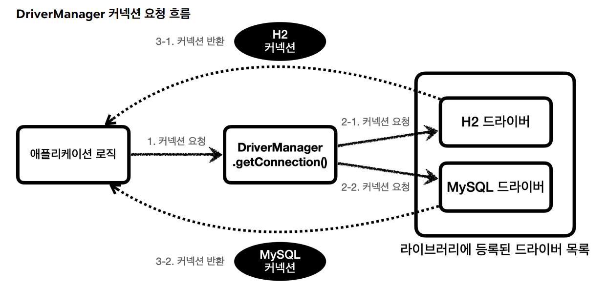

# 1. JDBC 이해
## JDBC 이해
### JDBC 등장 이유
클라이언트가 애플리케이션 서버를 통해 데이터를 저장하거나 조회하면, 애플리케이션 서버는 다음 과정을 통해서 데이터베이스를 사용한다.
1. 커넥션 연결: 주로 TCP/IP를 사용해서 커넥션을 연결한다.
2. SQL 전달: 애플리케이션 서버는 DB가 이해할 수 있는 SQL을 연결된 커넥션을 통해 DB에 전달한다.
3. 결과 응답: DB는 전달된 SQL을 수행하고 그 결과를 응답한다. 애플리케이션 서버는 응답 결과를 활용한다
- 문제는 각각의 데이터베이스마다 커넥션을 연결하는 방법, SQL을 전달하는 방법, 그리고 결과를 응답 받는 방법이 모두 다르다는 점이다.
- 이런 문제를 해결하기 위해 JDBC라는 자바 표준이 등장한다.

### JDBC 표준 인터페이스
- JDBC(Java Database Connectivity)는 자바에서 데이터베이스에 접속할 수 있도록 하는 자바 API다.
- 대표적으로 다음 3가지 기능을 표준 인터페이스로 정의해서 제공한다.
  - java.sql.Connection - 연결
  - java.sql.Statement - SQL을 담은 내용
  - java.sql.ResultSet - SQL 요청 응답
- 그런데 인터페이스만 있다고해서 기능이 동작하지는 않는다.
- 이 JDBC 인터페이스를 각각의 DB 벤더(회사)에서 자신의 DB에 맞도록 구현해서 라이브러리로 제공하는데, 이것을 JDBC 드라이버라 한다.
#### 표준화의 한계
- 데이터베이스를 변경하면 JDBC 코드는 변경하지 않아도 되지만 SQL은 해당 데이터베이스에 맞도록 변경해야한다.
- 참고로 JPA(Java Persistence API)를 사용하면 이렇게 각각의 데이터베이스마다 다른 SQL을 정의해야 하는 문제도 많은 부분 해결할 수 있다.

## JDBC와 최신 데이터 접근 기술
- JDBC는 1997년에 출시될 정도로 오래된 기술이고, 사용하는 방법도 복잡하다.
- 그래서 최근에는 JDBC를 직접 사용하기 보다는 JDBC를 편리하게 사용하는 다양한 기술이 존재한다.
- 대표적으로 SQL Mapper와 ORM 기술로 나눌 수 있다.
### SQL Mapper
- 장점: JDBC를 편리하게 사용하도록 도와준다.
  - SQL 응답 결과를 객체로 편리하게 변환해준다.
  - JDBC의 반복 코드를 제거해준다.
- 단점: 개발자가 SQL을 직접 작성해야한다.
- 대표 기술: 스프링 JdbcTemplate, MyBatis
### ORM
- ORM은 객체를 관계형 데이터베이스 테이블과 매핑해주는 기술이다.
- 이 기술 덕분에 개발자는 반복적인 SQL을 직접 작성하지 않고, ORM 기술이 개발자 대신에 SQL을 동적으로 만들어 실행해준다.
- 추가로 각각의 데이터베이스마다 다른 SQL을 사용하는 문제도 중간에서 해결해준다.
- 대표 기술: JPA, 하이버네이트, 이클립스링크
- JPA는 자바 진영의 ORM 표준 인터페이스이고, 이것을 구현한 것으로 하이버네이트와 이클립스 링크 등의 구현 기술이 있다
## 데이터베이스 연결
- 코드: src/main/java/hello/jdbc/connection/*
- 
- JDBC가 제공하는 DriverManager 는 라이브러리에 등록된 DB 드라이버들을 관리하고, 커넥션을 획득하는 기능을 제공한다.
- 애플리케이션 로직에서 커넥션이 필요하면 `DriverManager.getConnection()`을 호출한다.
- DriverManager 는 라이브러리에 등록된 드라이버 목록을 자동으로 인식한다. 이 드라이버들에게 순서대로 다음 정보를 넘겨서 커넥션을 획득할 수 있는지 확인한다.
- 이렇게 찾은 커넥션 구현체가 클라이언트에 반환된다.
- 여기선 H2 데이터베이스 드라이버만 라이브러리에 등록했기 때문에 H2 드라이버가 제공하는 H2 커넥션을 제공받는다.

## JDBC 개발 - 등록
- JDBC를 사용해서 회원( Member ) 데이터를 데이터베이스에 관리하는 기능을 개발해보자.
- schema.sql
```sql
drop table member if exists cascade;
create table member (
     member_id varchar(10),
     money integer not null default 0,
     primary key (member_id)
);
```
- 코드: src/main/java/hello/jdbc/domain/Member.java
- 코드: src/main/java/hello/jdbc/repository/MemberRepositoryV0.java
- 코드: src/test/java/hello/jdbc/repository/MemberRepositoryV0Test.java

## JDBC 개발 - 조회
- JDBC를 통해 이전에 저장한 데이터를 조회하는 기능을 개발해보자
- 코드: src/main/java/hello/jdbc/repository/MemberRepositoryV0.java
- 코드: src/test/java/hello/jdbc/repository/MemberRepositoryV0Test.java

## JDBC 개발 - 수정, 삭제
- 수정과 삭제는 등록과 비슷하다.
- 등록, 수정, 삭제처럼 데이터를 변경하는 쿼리는 executeUpdate() 를 사용하면 된다.
- 조회는 executeQuery() 를 사용한다.
- 코드: src/main/java/hello/jdbc/repository/MemberRepositoryV0.java
- 코드: src/test/java/hello/jdbc/repository/MemberRepositoryV0Test.java