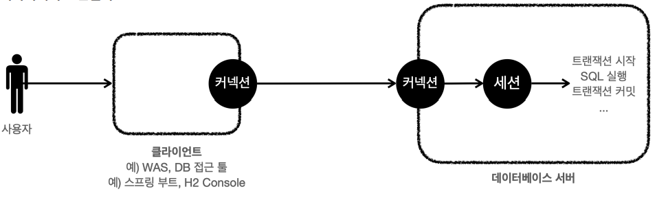
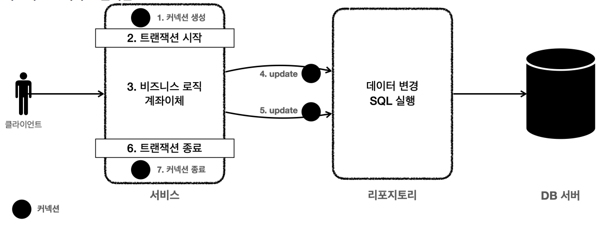

# 3. 트랜잭션 이해
## 트랜잭션 - 개념 이해
- 데이터를 저장할 때 단순히 파일에 저장해도 되는데, 데이터베이스에 저장하는 이유는 무엇일까?
- 여러가지 이유가 있지만, 가장 대표적인 이유는 바로 데이터베이스는 트랜잭션이라는 개념을 지원하기 때문이다.
- 모든 작업이 성공해서 데이터베이스에 정상 반영하는 것을 커밋( Commit )이라 하고,
- 작업 중 하나라도 실패해서 거래 이전으로 되돌리는 것을 롤백( Rollback )이라 한다.
### 트랜잭션 ACID
- 원자성(Atomicity): 트랜잭션 내에서 실행한 작업들은 마치 하나의 작업인 것처럼 모두 성공 하거나 모두 실패해야 한다.
- 일관성(Consistency): 모든 트랜잭션은 일관성 있는 데이터베이스 상태를 유지해야 한다.
- 격리성(Isolation): 동시에 실행되는 트랜잭션들이 서로에게 영향을 미치지 않도록 격리한다.
  - 트랜잭션 간에 격리성을 완벽히 보장하려면 트랜잭션을 거의 순서대로 실행해야 한다. 이렇게 하면 동시 처리 성능이 매우 나빠진다.
  - 이런 문제로 인해 ANSI 표준은 트랜잭션의 격리 수준을 4단계로 나누어 정의했다.
    - READ UNCOMMITED(커밋되지 않은 읽기)
    - READ COMMITTED(커밋된 읽기)
    - REPEATABLE READ(반복 가능한 읽기)
    - SERIALIZABLE(직렬화 가능)
- 지속성(Durability): 트랜잭션을 성공적으로 끝내면 그 결과가 항상 기록되어야 한다. 중간에 시스템에 문제가 발생해도 데이터베이스 로그 등을 사용해서 성공한 트랜잭션 내용을 복구해야 한다
## 데이터베이스 연결 구조와 DB 세션

- 사용자는 웹 애플리케이션 서버(WAS)나 DB 접근 툴 같은 클라이언트를 사용해서 데이터베이스 서버에 접근할수 있다.
- 클라이언트는 데이터베이스 서버에 연결을 요청하고 커넥션을 맺게 된다.
- 이때 데이터베이스 서버는 내부에 세션이라는 것을 만든다. 그리고 앞으로 해당 커넥션을 통한 모든 요청은 이 세션을 통해서 실행하게 된다.
- 세션은 트랜잭션을 시작하고, 커밋 또는 롤백을 통해 트랜잭션을 종료한다. 그리고 이후에 새로운 트랜잭션을 다시 시작할 수 있다.
- 사용자가 커넥션을 닫거나, 또는 DBA(DB 관리자)가 세션을 강제로 종료하면 세션은 종료된다.
- 커넥션 풀이 10개의 커넥션을 생성하면, 세션도 10개 만들어진다.
## 트랜잭션 - DB 예제1 - 개념 이해
- 데이터 변경 쿼리를 실행하고 데이터베이스에 그 결과를 반영하려면 커밋 명령어인 commit 을 호출하고, 결과를 반영하고 싶지 않으면 롤백 명령어인 rollback 을 호출하면 된다.
- 커밋을 호출하기 전까지는 임시로 데이터를 저장하는 것이다. 따라서 해당 트랜잭션을 시작한 세션(사용자)에게만 변경 데이터가 보이고 다른 세션(사용자)에게는 변경 데이터가 보이지 않는다.
## 트랜잭션 - DB 예제2 - 자동 커밋, 수동 커밋
### 자동 커밋
- 자동 커밋으로 설정하면 각각의 쿼리 실행 직후에 자동으로 커밋을 호출한다.
- 따라서 커밋이나 롤백을 직접 호출하지 않아도 되는 편리함이 있다.
- 하지만 쿼리를 하나하나 실행할 때 마다 자동으로 커밋이 되어버리기 때문에 우리가 원하는 트랜잭션 기능을 제대로 사용할 수 없다.
```sql
set autocommit true; //자동 커밋 모드 설정
insert into member(member_id, money) values ('data1',10000); //자동 커밋
insert into member(member_id, money) values ('data2',10000); //자동 커밋
```
### 수동 커밋
- commit , rollback 을 직접 호출하면서 트랜잭션 기능을 제대로 수행하려면 자동 커밋을 끄고 수동 커밋을 사용해야 한다.
```sql
set autocommit false; //수동 커밋 모드 설정
insert into member(member_id, money) values ('data3',10000);
insert into member(member_id, money) values ('data4',10000);
commit; //수동 커밋
```
- 보통 자동 커밋 모드가 기본으로 설정된 경우가 많기 때문에, 수동 커밋 모드로 설정하는 것을 **트랜잭션을 시작한다**고 표현할 수 있다.
- 수동 커밋 설정을 하면 이후에 꼭 commit, rollback 을 호출해야 한다.
~~## 트랜잭션 - DB 예제3 - 트랜잭션 실습~~
## 트랜잭션 - DB 예제4 - 계좌이체
- 만약 오토 커밋 모드로 동작하는데, 계좌이체 중간에 실패하면 어떻게 될까?
- 쿼리를 하나 실행할 때 마다 바로바로 커밋이 되어버리기 때문에 memberA 의 돈만 2000원 줄어드는 심각한 문제가 발생한다.
## DB 락 - 개념 이해
- 세션1이 트랜잭션을 시작하고 데이터를 수정하는 동안 아직 커밋을 수행하지 않았는데, 세션2에서 동시에 같은 데이터를 수정하게 되면 여러가지 문제가 발생한다.
- 바로 트랜잭션의 원자성이 깨지는 것이다. 여기에 더해서 세션1이 중간에 롤백을 하게 되면 세션2는 잘못된 데이터를 수정하는 문제가 발생한다.
- 이런 문제를 방지하려면, 세션이 트랜잭션을 시작하고 데이터를 수정하는 동안에는 커밋이나 롤백 전까지 다른 세션에서 해당 데이터를 수정할 수 없게 막아야 한다.
## DB 락 - 변경
- 락 대기 시간을 넘어가면 락 타임아웃 오류가 발생한다. 락 대기 시간은 설정할 수 있다. `SET LOCK_TIMEOUT 60000;` (단위: 밀리초, 기본값: 무한대) -> 60초
## DB 락 - 조회
- 일반적인 조회는 락을 사용하지 않는다
- 데이터를 조회할 때도 락을 획득하고 싶을 때가 있다.
  - 이럴 때는 select for update 구문을 사용하면 된다.
  - 이렇게 하면 세션1이 조회 시점에 락을 가져가버리기 때문에 다른 세션에서 해당 데이터를 변경할 수 없다.
  - 물론 이 경우도 트랜잭션을 커밋하면 락을 반납한다.
- 조회 시점에 락이 필요한 경우는 언제일까?
  - 트랜잭션 종료 시점까지 해당 데이터를 다른 곳에서 변경하지 못하도록 강제로 막아야 할 때 사용한다.
  - 예를 들어서 금액을 조회한 다음에 이 금액 정보로 어떤 계산을 수행한다.
  - 그런데 이 계산이 돈과 관련된 매우 중요한 계산이어서 계산을 완료할 때까지 금액을 다른곳에서 변경하면 안된다.
  - 이럴 때 조회 시점에 락을 획득하면 된다.
```sql
set autocommit false;
select * from member where member_id='memberA' for update;
```
## 트랜잭션 - 적용1
- [MemberServiceV1](/src/main/java/hello/jdbc/service/MemberServiceV1.java)
- [MemberServiceV1Test](/src/test/java/hello/jdbc/service/MemberServiceV1Test.java)
## 트랜잭션 - 적용2
### 애플리케이션에서 트랜잭션을 어떤 계층에 걸어야 할까?

- 트랜잭션은 **비즈니스 로직이 있는 서비스 계층**에서 시작해야 한다.
- 비즈니스 로직이 잘못되면 해당 비즈니스 로직으로 인해 문제가 되는 부분을 함께 롤백해야 하기 때문이다.
- 그런데 트랜잭션을 시작하려면 커넥션이 필요하다.
- 결국 서비스 계층에서 커넥션을 만들고, 트랜잭션 커밋 이후에 커넥션을 종료해야 한다.
- 애플리케이션에서 DB 트랜잭션을 사용하려면 트랜잭션을 사용하는 동안 같은 커넥션을 유지해야한다. 그래야 같은 세션을 사용할 수 있다.
- 애플리케이션에서 같은 커넥션을 유지하려면 커넥션을 파라미터로 전달해서 같은 커넥션이 사용되도록 해야 한다.
- [MemberRepositoryV2](/src/main/java/hello/jdbc/repository/MemberRepositoryV2.java)
- [MemberServiceV2](/src/main/java/hello/jdbc/service/MemberServiceV2.java)
- [MemberServiceV2Test](/src/test/java/hello/jdbc/service/MemberServiceV2Test.java)
