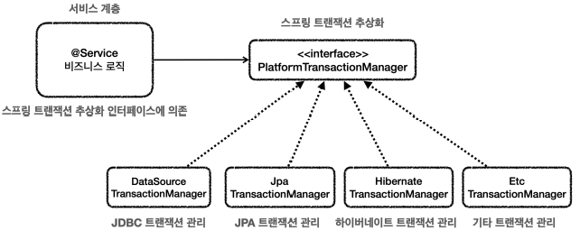
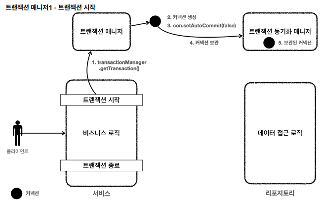
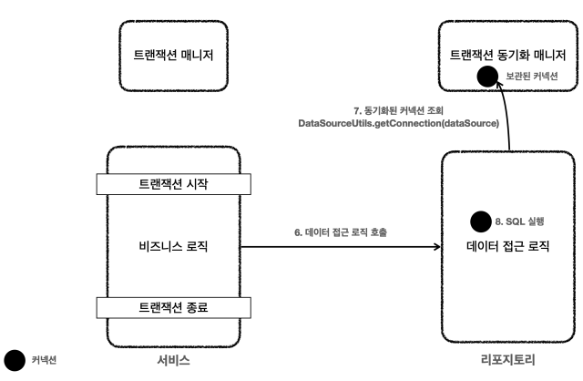
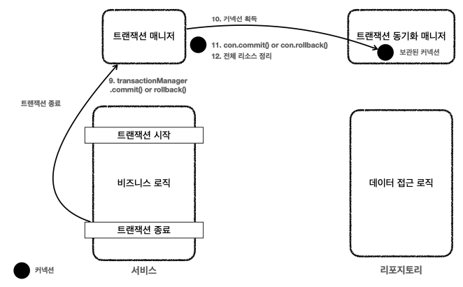
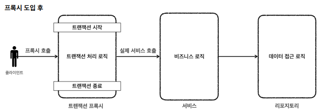

# 4. 스프링과 문제 해결 - 트랜잭션
## 문제점
### 애플리케이션 구조
1. 프레젠테이션 계층
- UI와 관련된 처리 담당
- 웹 요청과 응답
- 사용자 요청을 검증
- 주 사용 기술: 서블릿과 HTTP 같은 웹 기술, 스프링 MVC
2. 서비스 계층
- 비즈니스 로직을 담당
- 주 사용 기술: 핵심 비즈니스 로직이 들어있기에 최대한 변경없이 유지되어야 하므로, 가급적 특정 기술에 의존하지 않고 순수 자바 코드로 작성
3. 데이터 접근 계층
- 실제 데이터베이스에 접근하는 코드
- 주 사용 기술: JDBC, JPA, File, Redis, Mongo ..
### 기존 코드 문제점
#### 트랜잭션 문제
- 트랜잭션을 적용하기 위해 JDBC 구현 기술이 서비스 계층에 누수되었다.
- 트랜잭션 동기화 문제: 같은 트랜잭션을 유지하기 위해 커넥션을 파라미터로 넘겨야 한다.
    - 이때 파생되는 문제들도 있다. 똑같은 기능도 트랜잭션용 기능과 트랜잭션을 유지하지 않아도 되는 기능으로 분리해야 한다.
- 트랜잭션 적용 코드를 보면 반복이 많다. try , catch , finally ...
#### 예외 누수
- 데이터 접근 계층의 JDBC 구현 기술 예외가 서비스 계층으로 전파된다.
- SQLException 은 JDBC 전용 기술이다. 향후 JPA나 다른 데이터 접근 기술을 사용하면, 그에 맞는 다른 예외로 변경해야 하고, 결국 서비스 코드도 수정해야 한다.
#### JDBC 반복 문제
- 순수한 JDBC를 사용했다. 이 코드들은 유사한 코드의 반복이 너무 많다. try , catch , finally ...

## 트랜잭션 추상화

- 스프링 트랜잭션 추상화의 핵심은 PlatformTransactionManager 인터페이스이다. -> 앞으로 줄여서 **트랜잭션 매니저**라고 할 것이다.
- `org.springframework.transaction.PlatformTransactionManager`
- 스프링 5.3부터는 JDBC 트랜잭션을 관리할 때 DataSourceTransactionManager 를 상속받아서 약간의 기능을 확장한 JdbcTransactionManager 를 제공한다.

## 트랜잭션 동기화
스프링이 제공하는 트랜잭션 매니저는 크게 2가지 역할을 한다.
- 트랜잭션 추상화 : 앞에서 설명함
- 리소스 동기화
  - 트랜잭션을 유지하려면 트랜잭션의 시작부터 끝까지 같은 데이터베이스 커넥션을 유지해아한다.
  - 스프링은 트랜잭션 동기화 매니저를 제공한다.
  - 따라서 이전처럼 파라미터로 커넥션을 전달하지 않아도 된다.
### 동작 방식
1. 트랜잭션을 시작하려면 커넥션이 필요하다. 트랜잭션 매니저는 데이터소스를 통해 커넥션을 만들고 트랜잭션을 시작한다.
2. 트랜잭션 매니저는 트랜잭션이 시작된 커넥션을 트랜잭션 동기화 매니저에 보관한다.
3. 리포지토리는 트랜잭션 동기화 매니저에 보관된 커넥션을 꺼내서 사용한다. 따라서 파라미터로 커넥션을 전달하지 않아도 된다.
4. 트랜잭션이 종료되면 트랜잭션 매니저는 트랜잭션 동기화 매니저에 보관된 커넥션을 통해 트랜잭션을 종료하고, 커넥션도 닫는다.

## 트랜잭션 문제 해결 - 트랜잭션 매니저1
- [MemberRepositoryV3](/src/main/java/hello/jdbc/repository/MemberRepositoryV3.java)
- [MemberServiceV3_1](/src/main/java/hello/jdbc/service/MemberServiceV3_1.java)
- [MemberServiceV3_1Test](/src/test/java/hello/jdbc/service/MemberServiceV3_1Test.java)

### 전체 동작 흐름





## 트랜잭션 문제 해결 - 트랜잭션 템플릿
- 트랜잭션을 사용하는 로직을 살펴보면 다음과 같은 패턴이 반복되는 것을 확인할 수 있다.
- 트랜잭션을 시작하고, 비즈니스 로직을 실행하고, 성공하면 커밋하고, 예외가 발생해서 실패하면 롤백한다.
- 이럴 때 템플릿 콜백 패턴을 활용하면 이런 반복 문제를 깔끔하게 해결할 수 있다.
- 스프링은 TransactionTemplate 라는 템플릿 클래스를 제공한다.
```java
public class TransactionTemplate {
     private PlatformTransactionManager transactionManager;
     public <T> T execute(TransactionCallback<T> action){..} // 응답 값이 있을 때 사용
     void executeWithoutResult(Consumer<TransactionStatus> action){..} // 응답 값이 없을 때 사용
}
```
### 코드
- [MemberServiceV3_2](/src/main/java/hello/jdbc/service/MemberServiceV3_2.java)
- [MemberServiceV3_2Test](/src/test/java/hello/jdbc/service/MemberServiceV3_2Test.java)
### 아직 남은 문제점
- 트랜잭션 템플릿 덕분에, 트랜잭션을 사용할 때 반복하는 코드를 제거할 수 있었다.
- 하지만 이곳은 서비스 로직인데 비즈니스 로직 뿐만 아니라 트랜잭션을 처리하는 기술 로직이 함께 포함되어 있다.

## 트랜잭션 문제 해결 - 트랜잭션 AOP 이해
- 서비스 계층에 순수한 비즈니스 로직만 남긴다는 목표는 아직 달성하지 못했다.
- 이럴 때 스프링 AOP를 통해 프록시를 도입하면 문제를 깔끔하게 해결할 수 있다.
- AOP = Aspect Oriented Programming (관점 지향 프로그래밍)

### 프록시 도입 전
- 프록시를 도입하기 전에는 기존처럼 서비스의 로직에서 트랜잭션을 직접 시작한다.

### 프록시 도입 후

- 프록시를 사용하면 트랜잭션을 처리하는 객체와 비즈니스 로직을 처리하는 서비스 객체를 명확하게 분리할 수 있다.

### 스프링과 스프링 부트가 제공하는 트랜잭션 AOP
- 트랜잭션 같은 부가 기능을 핵심 비즈니스 로직에서 분리
- 프록시를 통해 트랜잭션 시작/커밋/롤백을 자동으로 처리
- @Transactional 애노테이션만 붙이면 트랜잭션 코드가 자동으로 적용됨

### 참고
- 스프링 AOP를 적용하려면 어드바이저, 포인트컷, 어드바이스가 필요하다.
- 스프링은 트랜잭션 AOP 처리를 위해 다음 클래스를 제공한다. 스프링 부트를 사용하면 해당 빈들은 스프링 컨테이너에 자동으로 등록된다.
  - 어드바이저: BeanFactoryTransactionAttributeSourceAdvisor
  - 포인트컷: TransactionAttributeSourcePointcut 
  - 어드바이스: TransactionIntercepto

## 트랜잭션 문제 해결 - 트랜잭션 AOP 적용
- [MemberServiceV3_3](/src/main/java/hello/jdbc/service/MemberServiceV3_3.java)
- [MemberServiceV3_3Test](/src/test/java/hello/jdbc/service/MemberServiceV3_3Test.java)

## 트랜잭션 문제 해결 - 트랜잭션 AOP 정리
### 선언적 트랜잭션 관리 vs 프로그래밍 방식 트랜잭션 관리
#### 선언적 트랜잭션 관리(Declarative Transaction Management)
- @Transactional 애노테이션 하나만 선언해서 매우 편리하게 트랜잭션을 적용하는 것을 선언적 트랜잭션 관리라 한다.
- 과거엔 XML에 설정하기도 했다.
#### 프로그래밍 방식의 트랜잭션 관리(programmatic transaction management)
- 트랜잭션 매니저 또는 트랜잭션 템플릿 등을 사용해서 트랜잭션 관련 코드를 직접 작성하는 것을 프로그래밍 방식의 트랜잭션 관리라 한다.
- 선언적 트랜잭션 관리가 프로그래밍 방식에 비해서 훨씬 간편하고 실용적이기 때문에 실무에서는 대부분 선언적 트랜잭션 관리를 사용한다.

## 스프링 부트의 자동 리소스 등록
- 스프링 부트가 등장하기 이전에는 데이터소스와 트랜잭션 매니저를 개발자가 직접 스프링 빈으로 등록해서 사용했다.
```java
@Bean
DataSource dataSource() {
    return new DriverManagerDataSource(URL, USERNAME, PASSWORD);
}

@Bean
PlatformTransactionManager transactionManager() {
    return new DataSourceTransactionManager(dataSource());
}
```
- 그런데 스프링 부트로 개발을 시작한 개발자라면 데이터소스나 트랜잭션 매니저를 직접 등록한 적이 없을 것이다.
### 데이터 소스 자동 등록
- 스프링 부트는 다음과 같이 application.properties 에 있는 속성을 사용해서 는 데이터소스( DataSource )를 스프링 빈에 자동으로 등록한다.
- application.properties
```properties
spring.datasource.url=jdbc:h2:tcp://localhost/~/test
spring.datasource.username=sa
spring.datasource.password=
```
### 트랜잭션 매니저 자동 등록
- 스프링 부트는 적절한 트랜잭션 매니저( PlatformTransactionManager )를 자동으로 스프링 빈에 등록한다.
  - 자동으로 등록되는 스프링 빈 이름: transactionManager
- 어떤 트랜잭션 매니저를 선택할지는 현재 등록된 라이브러리를 보고 판단하는데,
  - JDBC를 기술을 사용하면 DataSourceTransactionManager 를 빈으로 등록하고,
  - JPA를 사용하면 JpaTransactionManager 를 빈으로 등록한다.
  - 둘다 사용하는 경우 JpaTransactionManager 를 등록한다.
  - 참고로 JpaTransactionManager 는 DataSourceTransactionManager 가 제공하는 기능도 대부분 지원한다.
- [MemberServiceV3_4Test](/src/test/java/hello/jdbc/service/MemberServiceV3_4Test.java)