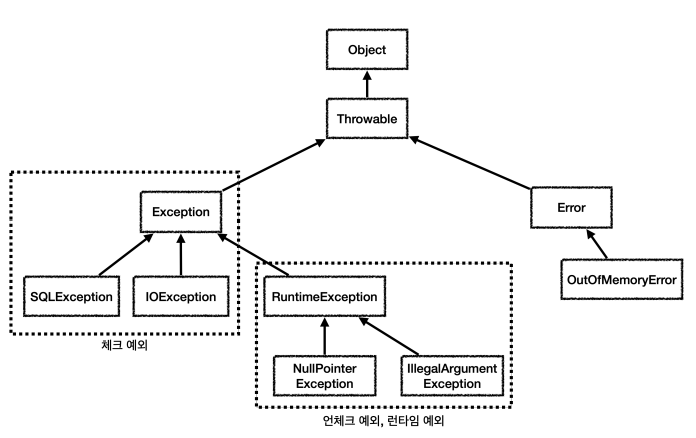

# 5. 자바 예외 이해
## 예외 계층

- Exception : 체크 예외 - 컴파일러가 예외 처리 강제
- RuntimeException : 언체크 예외 - 컴파일러가 예외 처리 강제하지 않음
- Error : 시스템 에러 - 애플리케이션에서 처리 불가

## 예외 기본 규칙
1. 예외는 잡아서 처리하거나 던져야 한다.
2. 예외를 잡거나 던질 때 지정한 예외뿐만 아니라 그 예외의 자식들도 함께 처리된다.
- 예를 들어서 Exception 을 catch 로 잡으면 그 하위 예외들도 모두 잡을 수 있다.
- 예를 들어서 Exception 을 throws 로 던지면 그 하위 예외들도 모두 던질 수 있다.

## 체크 예외 기본 이해
- Exception 과 그 하위 예외는 모두 컴파일러가 체크하는 체크 예외이다. 단 RuntimeException 은 예외로 한다.
- 체크 예외는 잡아서(catch) 처리하거나, 또는 밖으로 던지도록(throws) 선언해야한다. 그렇지 않으면 컴파일 오류가 발생한다.
- 코드: src/test/java/hello/jdbc/exception/basic/CheckedTest.java

### 체크 예외의 장단점
- 장점: 개발자가 실수로 예외를 누락하지 않도록 컴파일러를 통해 문제를 잡아주는 훌륭한 안전 장치이다.
- 단점: 하지만 실제로는 개발자가 모든 체크 예외를 반드시 잡거나 던지도록 처리해야 하기 때문에, 너무 번거로운 일이 된다. 크게 신경쓰고 싶지 않은 예외까지 모두 챙겨야 한다.

## 언체크 예외 기본 이해
- RuntimeException 과 그 하위 예외는 언체크 예외로 분류된다.
- 언체크 예외는 말 그대로 컴파일러가 예외를 체크하지 않는다는 뜻이다.
- 언체크 예외는 예외를 던지는 throws 를 선언하지 않고, 생략할 수 있다. 이 경우 자동으로 예외를 던진다.
- 코드: src/test/java/hello/jdbc/exception/basic/UncheckedTest.java

### 언체크 예외의 장단점
- 장점: 신경쓰고 싶지 않은 언체크 예외를 무시할 수 있다. 체크 예외의 경우 처리할 수 없는 예외를 밖으로 던지려면 항상 throws 예외 를 선언해야 하지만, 언체크 예외는 이 부분을 생략할 수 있다. 이후에 설명하겠지만, 신경쓰고 싶지 않은 예외의 의존관계를 참조하지 않아도 되는 장점이 있다.
- 단점: 언체크 예외는 개발자가 실수로 예외를 누락할 수 있다. 반면에 체크 예외는 컴파일러를 통해 예외 누락을 잡아준다.

## 체크 예외 VS 언체크 예외
- 체크 예외: 예외를 잡아서 처리하지 않으면 항상 throws 에 던지는 예외를 선언해야 한다.
- 언체크 예외: 예외를 잡아서 처리하지 않아도 throws 를 생략할 수 있다.

## 예외 활용 기본 원칙
1. 기본적으로 언체크(런타임) 예외를 사용하자.
2. 체크 예외는 비즈니스 로직상 의도적으로 던지는 예외에만 사용하자.
- 해당 예외를 잡아서 반드시 처리해야 하는 문제일 때만 체크 예외를 사용해야 한다
- 예)
    - 계좌 이체 실패 예외
    - 결제시 포인트 부족 예외
    - 로그인 ID, PW 불일치 예외

## 체크 예외 활용
- 코드: src/test/java/hello/jdbc/exception/basic/CheckedAppTest.java
### 체크 예외의 문제점
- 처리할 수 있는 체크 예외라면 서비스나 컨트롤러에서 처리하겠지만,
- 지금처럼 데이터베이스나 네트워크 통신처럼 시스템 레벨에서 올라온 예외들은 대부분 복구가 불가능하다.
- 그리고 실무에서 발생하는 대부분의 예외들은 이런 시스템 예외들이다.
- 문제는 이런 경우에 체크 예외를 사용하면 아래에서 올라온 복구 불가능한 예외를 서비스, 컨트롤러 같은 각각의 클래스가 모두 알고 있어야 한다.
- 그래서 불필요한 의존관계 문제가 발생하게 된다.

## 언체크 예외 활용
- 코드: src/test/java/hello/jdbc/exception/basic/UnCheckedAppTest.java
## 예외 포함과 스택 트레이스
