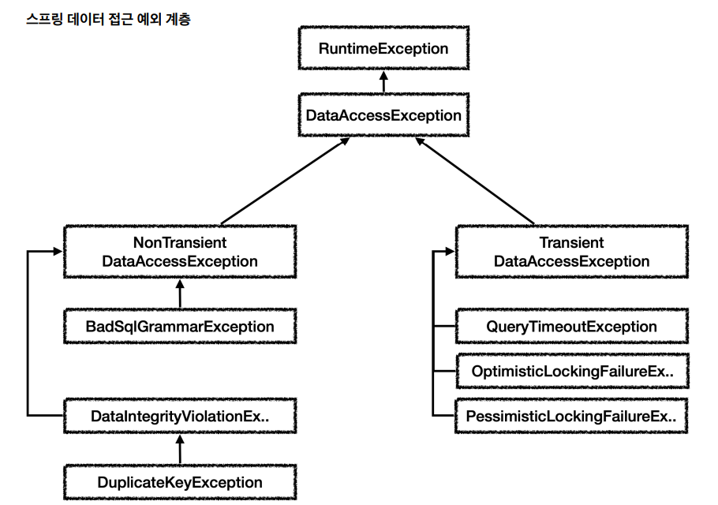

# 6. 스프링과 문제 해결 - 예외 처리, 반복
## 체크 예외와 인터페이스
- 서비스 계층은 가급적 특정 구현 기술에 의존하지 않고, 순수하게 유지하는 것이 좋다. 이렇게 하려면 예외에 대한 의존도 함께 해결해야한다.
- 예를 들어서 서비스가 처리할 수 없는 SQLException 에 대한 의존을 제거하려면 어떻게 해야할까?
- 서비스가 처리할 수 없으므로 리포지토리가 던지는 SQLException 체크 예외를 런타임 예외로 전환해서 서비스 계층에 던지자.
- 이렇게 하면 서비스 계층이 해당 예외를 무시할 수 있기 때문에, 특정 구현 기술에 의존하는 부분을 제거하고 서비스 계층을 순수하게 유지할 수 있다.

### 인터페이스 도입
- MemberRepository 인터페이스도 도입해서 구현 기술을 쉽게 변경할 수 있게 해보자.
- [MemberRepository](/src/main/java/hello/jdbc/repository/MemberRepository.java)
- 인터페이스를 도입하면, 구현 기술을 변경하고 싶을 때 DI를 사용해서 MemberService 코드의 변경 없이 구현 기술을 변경할 수 있다.

### 체크 예외와 인터페이스
- 기존에는 왜 이런 인터페이스를 만들지 않았을까?
- 여기서 체크 예외가 또 발목을 잡는다.
- 체크 예외를 사용하려면 인터페이스에도 해당 체크 예외가 선언 되어 있어야 한다.
- [MemberRepositoryEx](/src/main/java/hello/jdbc/repository/MemberRepositoryEx.java)
- 인터페이스가 특정 구현 기술에 종속된다는 문제가 발생한다.

## 런타임 예외 적용
- 런타임 예외는 이런 문제에서 자유롭다. 즉, 인터페이스가 특정 구현 기술에 종속되지 않는다.
- [MemberRepository](/src/main/java/hello/jdbc/repository/MemberRepository.java)
- [MyDbException](/src/main/java/hello/jdbc/repository/ex/MyDbException.java)
- [MemberRepositoryV4_1](/src/main/java/hello/jdbc/repository/MemberRepositoryV4_1.java)
- [MemberServiceV4](/src/main/java/hello/jdbc/service/MemberServiceV4.java)
- [MemberServiceV4Test](/src/test/java/hello/jdbc/service/MemberServiceV4Test.java)
### 해결된 문제
- 체크 예외를 런타임 예외로 변환하면서 인터페이스와 서비스 계층의 순수성을 유지할 수 있게 되었다.
- 다른 구현 기술로 변경하더라도 서비스 계층의 코드를 변경하지 않고 유지할 수 있다.
### 남은 문제
- 리포지토리에서 넘어오는 특정한 예외의 경우 복구를 시도할 수도 있다.
- 그런데 지금 방식은 항상 MyDbException이라는 예외만 넘어오기 때문에 예외를 구분할 수 없는 단점이 있다.
- 만약 특정 상황에는 예외를 잡아서 복구하고 싶으면 예외를 어떻게 구분해서 처리할 수 있을까?

## 데이터 접근 예외 직접 만들기
- [MyDuplicateKeyException](/src/main/java/hello/jdbc/repository/ex/MyDuplicateKeyException.java)
  - 이 예외는 데이터 중복의 경우 발생하는 예외이다.
- [ExTranslatorV1Test](/src/test/java/hello/jdbc/exception/translator/ExTranslatorV1Test.java)
### 해결된 문제
- SQL ErrorCode로 데이터베이스에 어떤 오류가 있는지 확인할 수 있었다.
- 예외 변환을 통해 SQLException 을 특정 기술에 의존하지 않는 직접 만든 예외인 MyDuplicateKeyException 로 변환 할 수 있었다.
- 리포지토리 계층이 예외를 변환해준 덕분에 서비스 계층은 특정 기술에 의존하지 않는 MyDuplicateKeyException 을 사용해서 문제를 복구하고, 서비스 계층의 순수성도 유지할 수 있었다.
### 남은 문제
- SQL ErrorCode는 각각의 데이터베이스 마다 다르다. 결과적으로 데이터베이스가 변경될 때 마다 ErrorCode도 모두 변경해야 한다.
- 예) 키 중복 오류 코드 (H2: 23505 vs MySQL: 1062)
- 데이터베이스가 전달하는 오류는 키 중복 뿐만 아니라 락이 걸린 경우, SQL 문법에 오류 있는 경우 등등 수십 수백가지 오류 코드가 있다.
- 이 모든 상황에 맞는 예외를 지금처럼 다 만들어야 할까? 추가로 앞서 이야기한 것처럼 데이터베이스마다 이 오류 코드는 모두 다르다.

## 스프링 예외 추상화 이해
- 스프링은 앞서 설명한 문제들을 해결하기 위해 데이터 접근과 관련된 예외를 추상화해서 제공한다.
- 스프링은 데이터 접근 계층에 대한 수십 가지 예외를 정리해서 일관된 예외 계층을 제공한다.
- 각각의 예외는 특정 기술에 종속적이지 않게 설계되어 있다. 따라서 서비스 계층에서도 스프링이 제공하는 예외를 사용하면 된다.

- 예외의 최고 상위는 org.springframework.dao.DataAccessException 이다.
- 그림에서 보는 것 처럼 런타임 예외를 상속 받았기 때문에 스프링이 제공하는 데이터 접근 계층의 모든 예외는 런타임 예외이다.
- DataAccessException 은 크게 2가지로 구분하는데 NonTransient 예외와 Transient 예외이다.
  - Transient 는 일시적이라는 뜻이다. Transient 하위 예외는 동일한 SQL을 다시 시도했을 때 성공할 가능성이 있다.
  - NonTransient 는 일시적이지 않다는 뜻이다. 같은 SQL을 그대로 반복해서 실행하면 실패한다.

### 스프링이 제공하는 예외 변환기
- 스프링은 예외 변환기를 제공한다. 예외 변환기는 특정 기술에 종속적인 예외를 스프링이 제공하는 예외로 변환해준다.
- [SpringExceptionTranslatorTest](/src/test/java/hello/jdbc/exception/translator/SpringExceptionTranslatorTest.java)
- 스프링은 데이터 접근 계층에 대한 일관된 예외 추상화를 제공한다.
- 스프링은 예외 변환기를 통해서 SQLException 의 ErrorCode 에 맞는 적절한 스프링 데이터 접근 예외로 변환해준다.
- 스프링 예외 추상화 덕분에 특정 기술에 종속적이지 않게 되었다.

## 스프링 예외 추상화 적용
- 이제 우리가 만든 애플리케이션에 스프링이 제공하는 데이터 접근 예외 추상화와 SQL 예외 변환기를 적용해보자.
- [MemberRepositoryV4_2](/src/main/java/hello/jdbc/repository/MemberRepositoryV4_2.java)
- [MemberServiceV4Test](/src/test/java/hello/jdbc/service/MemberServiceV4Test.java)

## JDBC 반복 문제 해결 - JdbcTemplate
- 이번에는 리포지토리에서 JDBC를 사용하기 때문에 발생하는 반복 문제를 해결해보자.
- JDBC 반복 문제
  - 커넥션 조회, 커넥션 동기화
  - PreparedStatement 생성 및 파라미터 바인딩
  - 쿼리 실행
  - 결과 바인딩
  - 예외 발생시 스프링 예외 변환기 실행
  - 리소스 종료
- 이런 반복을 효과적으로 처리하는 방법이 바로 템플릿 콜백 패턴이다.
- [MemberRepositoryV5](/src/main/java/hello/jdbc/repository/MemberRepositoryV5.java)
- JdbcTemplate 은 JDBC로 개발할 때 발생하는 반복을 대부분 해결해준다.
- 그 뿐만 아니라 지금까지 학습했던, 트랜잭션을 위한 커넥션 동기화는 물론이고, 예외 발생시 스프링 예외 변환기도 자동으로 실행해준다.